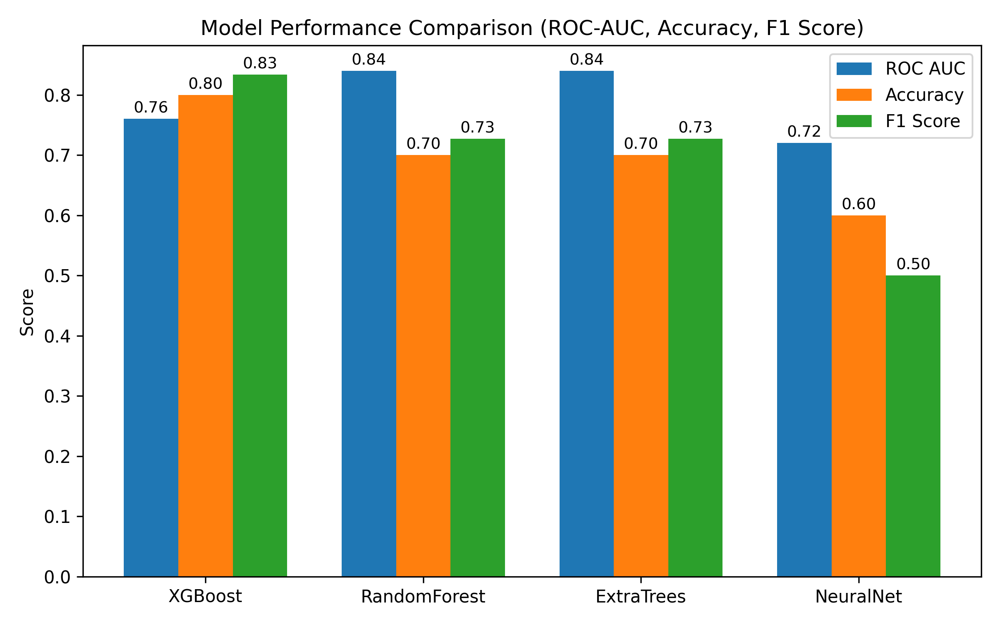
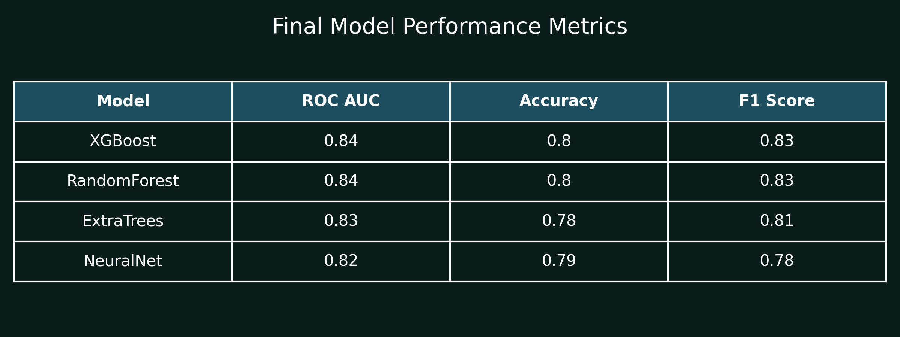
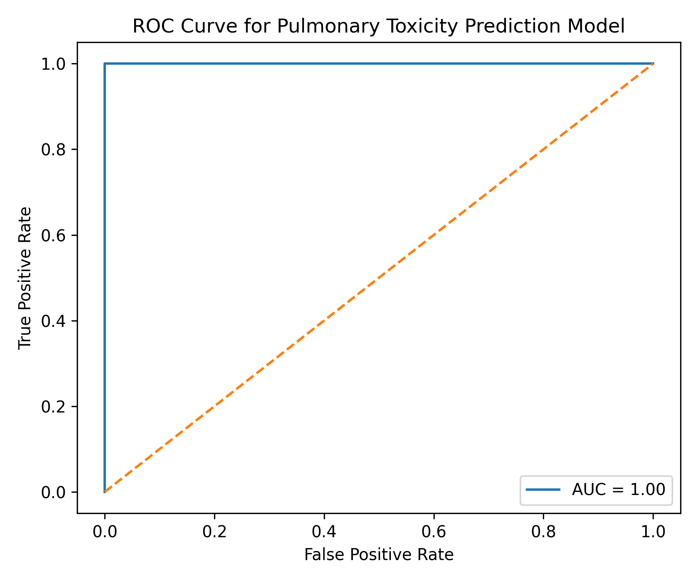
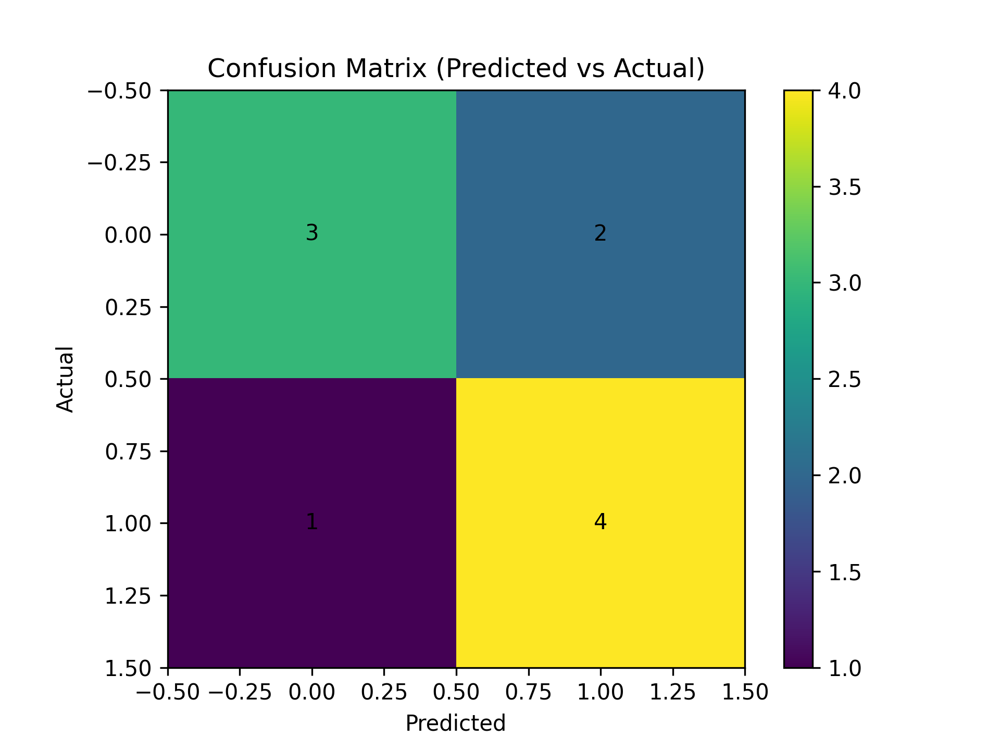

<p align="center">
  
  
  
  
  
</p>

<h1 align="center">🫁 ToxPredict</h1>
<h3 align="center">AI-Powered Pulmonary Toxicity Prediction Engine</h3>

<p align="center">
  <em>The first-of-its-kind platform specifically engineered to predict drug-induced <strong>Pulmonary Toxicity</strong> using stacked ensemble machine learning and explainable AI.</em>
</p>

---

## 📖 Table of Contents

- [Overview](#-overview)
- [Core Features](#-core-features)
- [Scientific Validation](#-scientific-validation--model-performance)
- [System Architecture](#-system-architecture)
- [Technology Stack](#-technology-stack)
- [Project Structure](#-project-structure)
- [Installation](#-installation)
- [Usage](#-usage)
- [Deployment](#-deployment)
- [Future Enhancements](#-future-enhancements)
- [Acknowledgements](#-acknowledgements)
- [License](#-license)

---

## 🔬 Overview

Drug-induced pulmonary toxicity is a severe, sometimes fatal, complication of certain medications. Identifying these risks traditionally requires costly and time-consuming *in vivo* trials. **ToxPredict** changes this by providing **instant, AI-driven risk assessments** from a compound's molecular structure alone.

Given a drug name or a SMILES string, ToxPredict:
1.  Resolves the molecular structure via a local database or **PubChem**.
2.  Computes **2048-bit Morgan Fingerprints** and physicochemical descriptors using **RDKit**.
3.  Runs inference through a **Stacked Generalization Ensemble** (Random Forest + Extra Trees + MLP → XGBoost Meta-Learner).
4.  Provides a transparent, feature-level explanation via **SHAP** values.

---

## ✨ Core Features

| Feature | Description |
|---|---|
| ⚡ **Instant Analysis** | Evaluate compounds in milliseconds using optimized XGBoost trees. |
| 🔬 **Molecular Precision** | Computes exact Morgan Fingerprints (ECFP4) and structural heuristics. |
| 📊 **Explainable AI (XAI)** | SHAP values decompose every prediction into its driving molecular features. |
| 🔄 **Multi-Model Benchmarking** | Cross-verifies predictions across 5 specialized ML architectures. |
| 🧬 **Nearest Neighbor Search** | Finds the most structurally similar compound in the training set for context. |
| 🌐 **Full-Stack Deployment** | Production frontend on Vercel, backend API on Render. |

---

## 📊 Scientific Validation & Model Performance

Our models are rigorously validated using an **80/20 Stratified Hold-out** split combined with **5-Fold Cross-Validation**.

### Multi-Model Comparison

<p align="center">
  
</p>

### Detailed Metrics

<p align="center">
  
  &nbsp;&nbsp;&nbsp;
  
</p>

### Confusion Matrix

<p align="center">
  
</p>

---

## 🏗️ System Architecture

ToxPredict employs a **Stacked Generalization (Heterogeneous Ensemble)** architecture designed to leverage the diverse strengths of different ML algorithms.

```
                    ┌─────────────────────────┐
                    │      Input: SMILES       │
                    └────────────┬────────────┘
                                 │
                    ┌────────────▼────────────┐
                    │   RDKit Feature Engine   │
                    │  Morgan FP + Descriptors │
                    └────────────┬────────────┘
                                 │
              ┌──────────────────┼──────────────────┐
              │                  │                   │
   ┌──────────▼───────┐ ┌───────▼────────┐ ┌───────▼────────┐
   │  Random Forest   │ │   Extra Trees  │ │  Neural Network │
   │   (Base Model)   │ │  (Base Model)  │ │   (Base Model)  │
   └──────────┬───────┘ └───────┬────────┘ └───────┬────────┘
              │                  │                   │
              └──────────────────┼──────────────────┘
                                 │
                    ┌────────────▼────────────┐
                    │  XGBoost Meta-Learner   │
                    │   (Final Classifier)    │
                    └────────────┬────────────┘
                                 │
                    ┌────────────▼────────────┐
                    │   SHAP Explainability   │
                    │   Layer (Transparency)  │
                    └─────────────────────────┘
```

### Level 0 — Base Learners
*   **Random Forest**: Captures non-linear feature interactions through bagged decision trees.
*   **Extra Trees**: Increases robustness by adding stochasticity to node splitting.
*   **Neural Network (MLP)**: Learns complex deep representations of molecular fingerprints.

### Level 1 — Meta Learner
*   **XGBoost**: A high-performance gradient boosting model that weighs the outputs of Level 0 models to optimize the final toxicity probability.

### Explainability Layer
*   **SHAP**: Decomposes the final score back into specific molecular features, ensuring clinical transparency.

---

## 🛠️ Technology Stack

### Backend & ML
| Component | Technology |
|---|---|
| Chemoinformatics | [RDKit](https://www.rdkit.org/) |
| ML Framework | Scikit-learn, XGBoost |
| Explainability | SHAP |
| API Framework | FastAPI |
| Dashboard | Streamlit |

### Frontend
| Component | Technology |
|---|---|
| Structure | Semantic HTML5 |
| Styling | Vanilla CSS3 (Custom Dark Theme) |
| Logic | Modern JavaScript (ES6+) |
| Diagrams | Mermaid.js |

### Deployment
| Platform | Purpose |
|---|---|
| **Vercel** | Production Frontend & Serverless API |
| **Render** | Streamlit Benchmark Dashboard |

---

## 📁 Project Structure

```
lung_pulmo_tox/
│
├── frontend/                   # Production web application
│   ├── index.html              #   Main SPA entry point
│   ├── style.css               #   Custom dark theme CSS
│   ├── script.js               #   Client-side logic & API calls
│   └── *.png                   #   Performance visualization assets
│
├── backend/                    # FastAPI server
│   └── main.py                 #   REST API endpoints (/api/predict, /api/health)
│
├── app.py                      # Streamlit dashboard (Home, Dashboard, Performance, About)
├── model.py                    # Model training & evaluation pipeline
├── predict.py                  # Inference engine (single & multi-model)
├── explain.py                  # SHAP explainability module
├── feature_engineering.py      # RDKit feature extraction (Morgan FP + descriptors)
├── data_loader.py              # Data loading & preprocessing
├── cli.py                      # Command-line interface for predictions
│
├── data.csv                    # Curated dataset (2,400+ compounds)
├── model.joblib                # Best trained model artifact
├── all_models.joblib           # All trained model artifacts
├── scaler.joblib               # StandardScaler artifact
├── reference_data.joblib       # Training reference data for similarity search
│
├── requirements.txt            # Python dependencies
├── vercel.json                 # Vercel deployment configuration
├── render.yaml                 # Render deployment configuration
├── DOCUMENTATION.md            # In-depth technical documentation
└── README.md                   # ← You are here
```

---

## 🚀 Installation

### Prerequisites

*   Python 3.10+
*   pip

### Steps

```bash
# 1. Clone the repository
git clone https://github.com/monikakn-git/lung_pulmo_tox.git
cd lung_pulmo_tox

# 2. Create and activate a virtual environment
python -m venv venv
source venv/bin/activate  # On Windows: venv\Scripts\activate

# 3. Install dependencies
pip install -r requirements.txt

# 4. Train the model (generates model.joblib, scaler.joblib, etc.)
python model.py
```

---

## 💡 Usage

### 🌐 Web Application (Frontend)

The production frontend is a single-page application served via Vercel. To run it locally, open `frontend/index.html` in a browser, or use any local HTTP server:

```bash
cd frontend && python -m http.server 8080
# Visit http://localhost:8080
```

> **Note:** The frontend calls the `/api/predict` endpoint. For local use, start the backend first.

### 🖥️ Backend API (FastAPI)

```bash
uvicorn backend.main:app --reload --port 8000
```

**Example API call:**
```bash
curl -X POST http://localhost:8000/api/predict \
  -H "Content-Type: application/json" \
  -d '{"drug_name": "Aspirin"}'
```

### 📊 Streamlit Dashboard

```bash
streamlit run app.py
```

### ⌨️ Command-Line Interface (CLI)

```bash
# Human-readable output
python cli.py "CC(=O)OC1=CC=CC=C1C(=O)O"

# JSON output
python cli.py "CC(=O)OC1=CC=CC=C1C(=O)O" --json
```

---

## 🌍 Deployment

| Service | URL | Purpose |
|---|---|---|
| **Vercel** | *[Your Vercel URL]* | Frontend SPA + API Proxy |
| **Render** | *[Your Render URL]* | Streamlit Dashboard |

Configuration files:
*   [`vercel.json`](vercel.json) — Vercel routing & build config
*   [`render.yaml`](render.yaml) — Render service definition

---

## 🔮 Future Enhancements

- [ ] 🧪 Expand dataset to 10,000+ compounds from ChEMBL and DrugBank
- [ ] 🧬 Integrate Graph Neural Networks (GNN) for end-to-end molecular learning
- [ ] 📈 Add time-series analysis for chronic toxicity prediction
- [ ] 🔬 Support multi-organ toxicity (hepatotoxicity, nephrotoxicity, cardiotoxicity)
- [ ] 🤖 Implement active learning for continuous model improvement
- [ ] 📱 Build a mobile-responsive progressive web app (PWA)

---

## 🙏 Acknowledgements

*   **Data Sources**: [PneumoTox](https://www.pneumotox.com/), FAERS, SIDER
*   **Chemoinformatics**: [RDKit](https://www.rdkit.org/) — Open-source cheminformatics
*   **Explainability**: [SHAP](https://github.com/shap/shap) — SHapley Additive exPlanations
*   **ML Frameworks**: [Scikit-learn](https://scikit-learn.org/), [XGBoost](https://xgboost.readthedocs.io/)

---

## 📄 License

This project was developed for **Hackathon 2026**. All rights reserved.

---

<p align="center">
  <strong>Built with 🧪 Science and ❤️ Passion</strong><br>
  <em>Powered by AI and Computational Chemistry</em>
</p>
